# 📊 Excel Data Intelligence Project

> **A comprehensive Excel-based data analytics project showcasing advanced spreadsheet techniques, business intelligence, and data storytelling.**

---

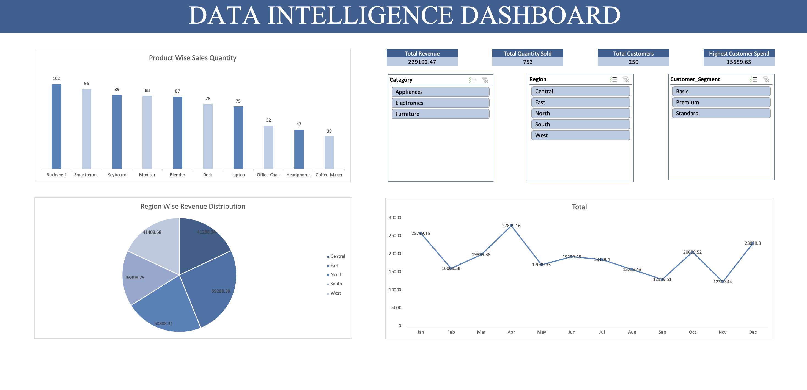

---

## 📁 Project Structure

```
Excel_Final_Pr/
├── PR. Final Project.xlsx       # Main Excel workbook
└── Screenshots/
    ├── Dashboard.png
    ├── 1_Date_Time.png
    ├── 2_Filter.png
    ├── 3_ConditionalFormating.png
    ├── 4_WhatIF.png
    ├── 5_Regression.png
    ├── 6_Storytelling.png
    ├── 7_HighValueCustomer.png
    ├── 8_PivotTables.png
    ├── 9_MatchingNames.png
    └── 10_Final_Report.png
```

---

## 🎯 Project Overview

This project demonstrates a **complete data analytics workflow** built entirely in Microsoft Excel — from raw transaction data to an interactive business intelligence dashboard. It covers date/time engineering, dynamic filtering, conditional logic, scenario planning, regression analysis, pivot reporting, and customer segmentation — all culminating in an executive-ready insights report and a live dashboard.

| Metric | Value |
|---|---|
| 💰 Total Revenue | ₹2,29,192.47 |
| 📦 Total Quantity Sold | 753 Units |
| 👥 Total Customers | 250 |
| 🏆 Highest Customer Spend | ₹15,659.65 |

---

## 🛠️ Features & Techniques

### 1️⃣ Date & Time Engineering

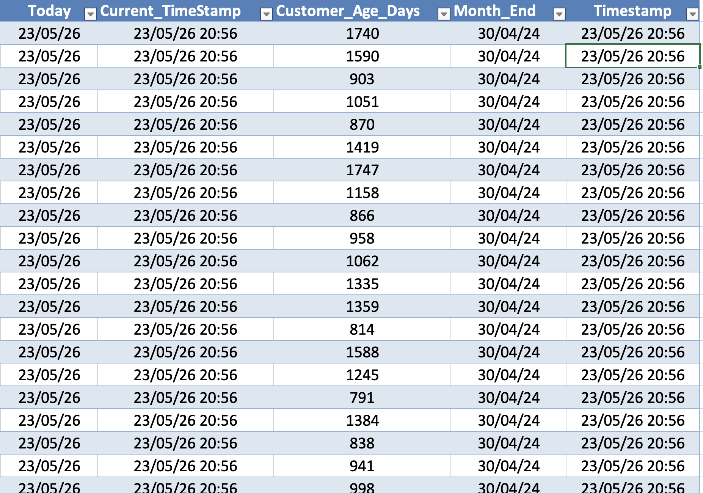

Dynamic date columns were engineered to enable time-based analysis:

- **`TODAY()`** — Captures the current date dynamically
- **`NOW()`** — Records the current timestamp
- **`Customer_Age_Days`** — Calculates how long each customer has been active (ranging from ~791 to ~1747 days)
- **`EOMONTH()`** — Computes the last day of each transaction month for period-end reporting
- **`Timestamp`** — Logs the exact moment of data refresh

> These formulas ensure the workbook stays live and auto-updates with every open.

---

### 2️⃣ FILTER Function — Multi-Value Dynamic Returns

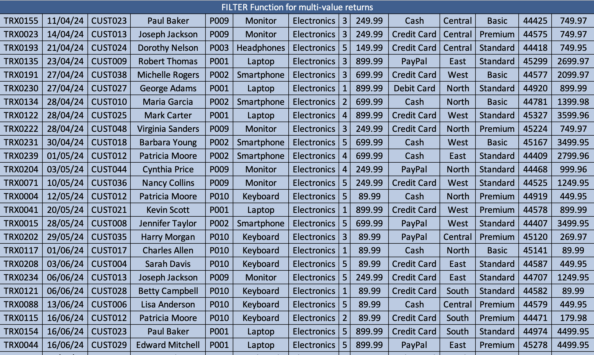

Using Excel's modern **`FILTER()`** function to return entire rows matching business criteria:

```excel
=FILTER(TransactionTable, [Category]="Electronics", "No Results")
```

- Returns **all Electronics transactions** dynamically
- Supports **multi-condition filtering** without manual copy-paste
- Results auto-expand as new data is added — zero maintenance

---

### 3️⃣ Conditional Formatting — Visual Data Signals

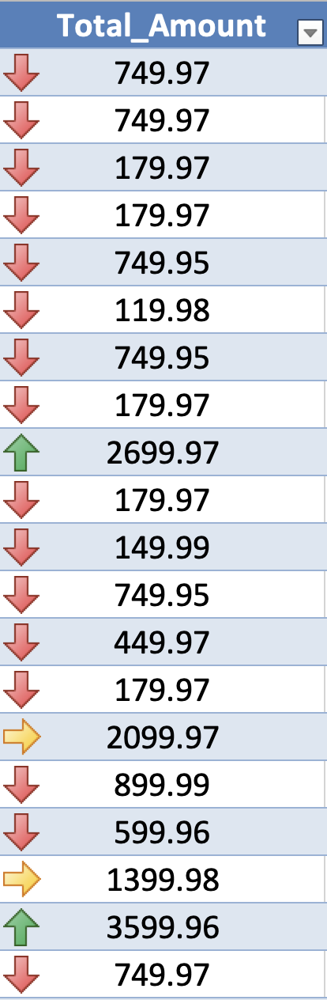

Applied **icon sets and color scales** on the `Total_Amount` column to create instant visual cues:

| Icon | Meaning |
|---|---|
| 🟢 Green Arrow ↑ | High-value transaction (e.g., ₹2,699.97 – ₹3,599.96) |
| 🟡 Yellow Arrow → | Mid-range transaction |
| 🔴 Red Arrow ↓ | Lower-value transaction |

This allows managers to scan hundreds of rows and instantly identify outliers without reading every number.

---

### 4️⃣ What-If Analysis — Goal Seek & Scenario Manager

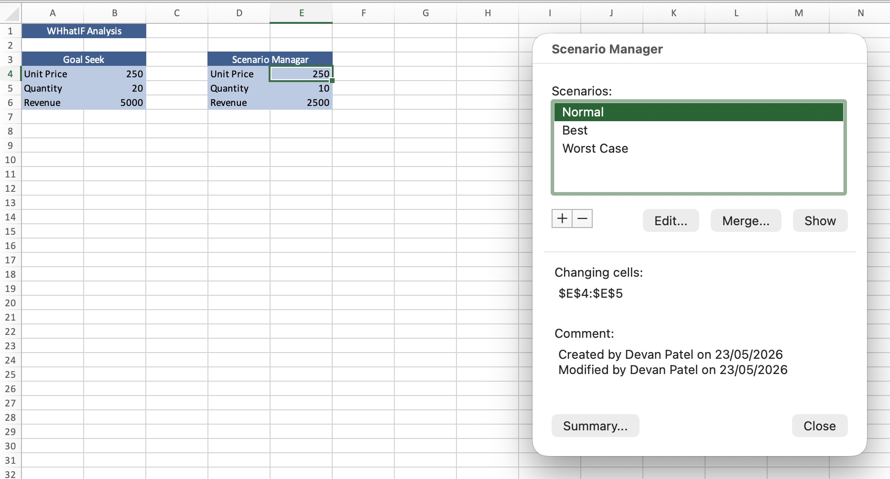

Two powerful planning tools were implemented side-by-side:

**Goal Seek**
- Set target Revenue = ₹5,000
- Automatically back-calculated required Quantity = 20 units at ₹250/unit

**Scenario Manager**
Three business scenarios modeled for Unit Price & Quantity:

| Scenario | Unit Price | Quantity | Revenue |
|---|---|---|---|
| Normal | ₹250 | 10 | ₹2,500 |
| Best Case | Higher | Higher | — |
| Worst Case | Lower | Lower | — |

> Scenario Manager enables leadership to make data-driven decisions by comparing outcomes side-by-side without altering the original model.

---

### 5️⃣ Regression Analysis

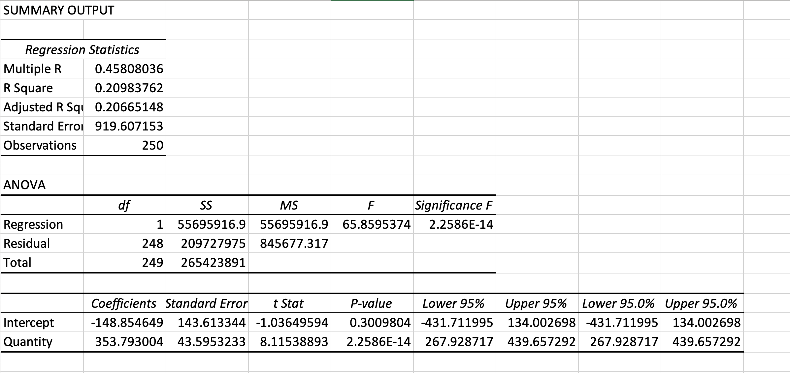

A **simple linear regression** was run using Excel's Data Analysis ToolPak to model the relationship between **Quantity Sold → Total Revenue**.

**Key Statistics:**

| Statistic | Value |
|---|---|
| Multiple R | 0.458 |
| R Square | 0.210 |
| Adjusted R² | 0.207 |
| Standard Error | 919.61 |
| Observations | 250 |
| F-Statistic | 65.86 |
| Significance F | 2.26E-14 ✅ |

**Regression Equation:**
```
Revenue = -148.85 + (353.79 × Quantity)
```

> The model is statistically significant (p < 0.0001). Each additional unit sold is associated with ~₹354 in additional revenue.

---

### 6️⃣ Storytelling with Data

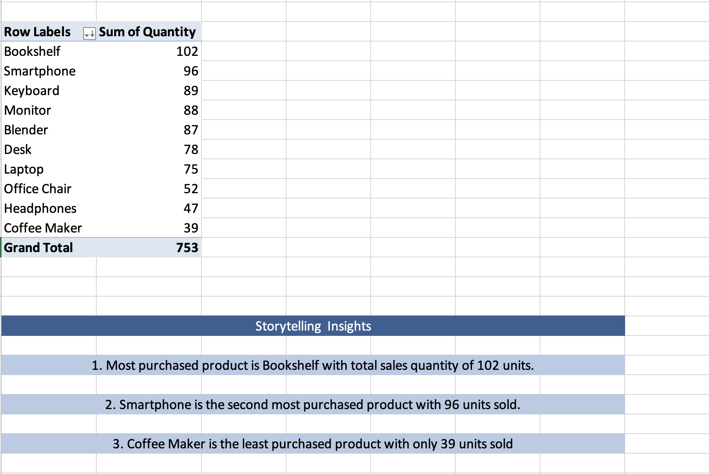

A pivot table was transformed into a **narrative insights block** — converting raw numbers into business language:

| Rank | Product | Units Sold |
|---|---|---|
| 🥇 1st | Bookshelf | 102 |
| 🥈 2nd | Smartphone | 96 |
| 🥉 3rd | Keyboard | 89 |
| … | … | … |
| Last | Coffee Maker | 39 |

**Auto-generated Storytelling Insights:**
> 1. Most purchased product is **Bookshelf** with total sales quantity of **102 units.**
> 2. **Smartphone** is the second most purchased product with **96 units** sold.
> 3. **Coffee Maker** is the least purchased product with only **39 units** sold.

---

### 7️⃣ High-Value Customer Segmentation

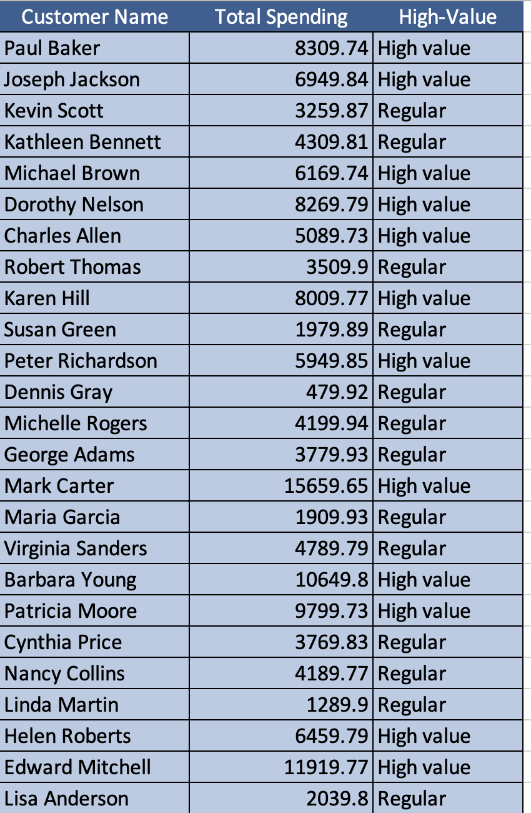

Customers were classified using an **IF-based formula** on total spending:

```excel
=IF(TotalSpending > 5000, "High value", "Regular")
```

**Top High-Value Customers:**

| Customer | Total Spend | Segment |
|---|---|---|
| Mark Carter | ₹15,659.65 | 🏆 High Value |
| Patricia Moore | ₹9,799.73 | 🏆 High Value |
| Barbara Young | ₹10,649.80 | 🏆 High Value |
| Edward Mitchell | ₹11,919.77 | 🏆 High Value |
| Paul Baker | ₹8,309.74 | 🏆 High Value |

> This segmentation enables targeted marketing campaigns and personalized customer retention strategies.

---

### 8️⃣ Pivot Tables & Charts

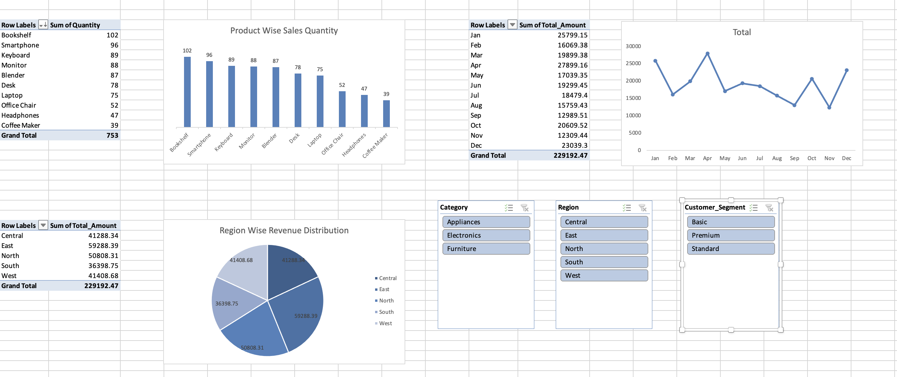

Multiple pivot tables and linked charts were built for multi-dimensional analysis:

- **Product Wise Sales Quantity** — Bar chart showing all 10 products
- **Monthly Revenue Trend** — Line chart from Jan–Dec revealing seasonality
- **Region Wise Revenue Distribution** — Pie chart across 5 regions

| Region | Revenue |
|---|---|
| East | ₹59,288.39 🥇 |
| North | ₹50,808.31 |
| Central | ₹41,288.34 |
| West | ₹41,408.68 |
| South | ₹36,398.75 🔻 |

**Interactive Slicers** added for:
- `Category` (Appliances / Electronics / Furniture)
- `Region` (Central / East / North / South / West)
- `Customer_Segment` (Basic / Premium / Standard)

---

### 9️⃣ Matching Names & Text Functions

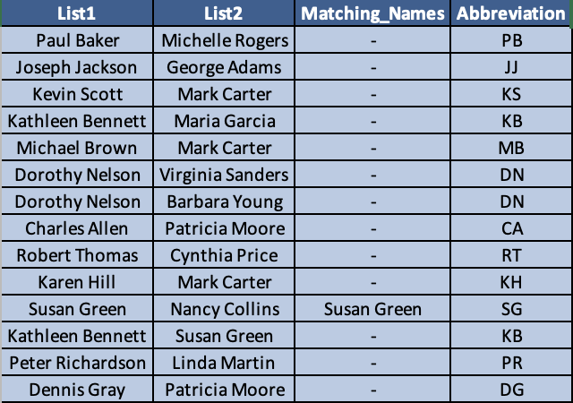

Cross-list name matching and abbreviation generation using text formulas:

```excel
=IF(ISNUMBER(MATCH(List1, List2, 0)), List1, "-")
```

```excel
=LEFT(FirstName,1) & LEFT(LastName,1)   → Initials Abbreviation
```

- Compares two customer lists and flags **common names** (e.g., Susan Green appears in both)
- Generates **initials** for every customer (e.g., Paul Baker → `PB`)

> Useful for deduplication, CRM data cleaning, and list reconciliation workflows.

---

### 🔟 Final Insights Report

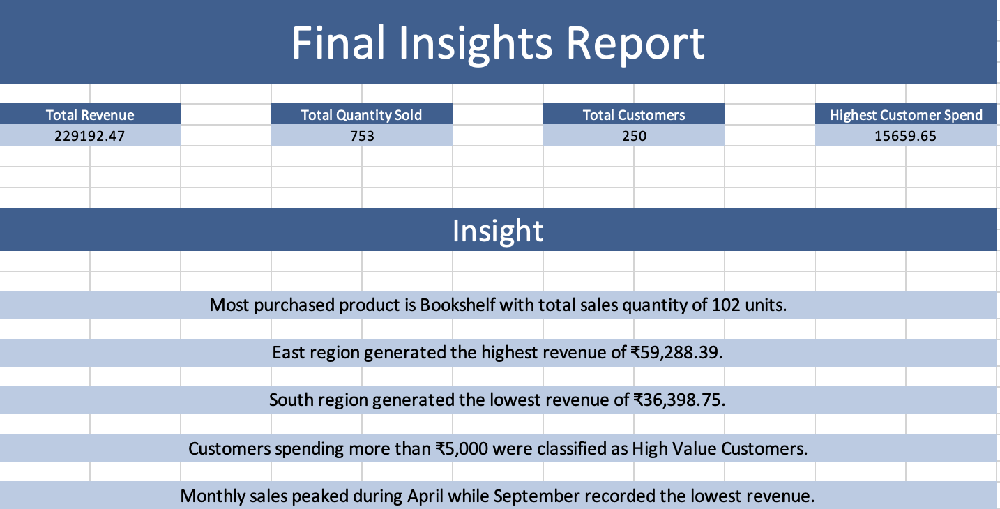

An executive summary sheet consolidating all analysis into a single-page report:

**KPI Summary:**

| KPI | Value |
|---|---|
| Total Revenue | ₹2,29,192.47 |
| Total Quantity Sold | 753 |
| Total Customers | 250 |
| Highest Customer Spend | ₹15,659.65 |

**Business Insights:**
- 📦 Most purchased product is **Bookshelf** with **102 units** sold
- 🌏 **East region** generated the highest revenue of **₹59,288.39**
- 📉 **South region** generated the lowest revenue of **₹36,398.75**
- 💎 Customers spending more than **₹5,000** were classified as High Value Customers
- 📅 Monthly sales **peaked in April** while **September** recorded the lowest revenue

---

## 📈 Data Intelligence Dashboard


The final dashboard integrates all analysis into a single, interactive view:

- **Product Wise Sales Quantity** bar chart
- **Region Wise Revenue Distribution** pie chart
- **Monthly Revenue Trend** line chart (Jan–Dec)
- **Live KPI tiles** — Revenue, Quantity, Customers, Top Spend
- **Interactive Slicers** — filter the entire dashboard by Category, Region & Segment

> Built entirely without any BI tools — 100% native Excel.

---

## 🧰 Excel Skills Demonstrated

| Category | Techniques Used |
|---|---|
| **Date & Time** | `TODAY()`, `NOW()`, `EOMONTH()`, date arithmetic |
| **Dynamic Arrays** | `FILTER()` with multi-condition logic |
| **Conditional Formatting** | Icon sets, color scales, rule-based formatting |
| **What-If Analysis** | Goal Seek, Scenario Manager (3 scenarios) |
| **Statistical Analysis** | Linear Regression via Data Analysis ToolPak |
| **Pivot Tables** | Multi-table, grouped by product/region/month |
| **Charts** | Bar, Line, Pie with custom formatting |
| **Slicers** | Category, Region, Customer Segment |
| **Text Functions** | `LEFT()`, `ISNUMBER()`, `MATCH()`, concatenation |
| **Logical Functions** | `IF()`, nested conditions |
| **Data Storytelling** | Narrative insight blocks from pivot output |

---

## 🚀 Getting Started

1. **Clone or download** this repository
2. Open **`PR. Final Project.xlsx`** in Microsoft Excel (2019 or later / Microsoft 365 recommended)
3. Enable **macros** if prompted
4. Navigate through the sheet tabs to explore each analysis section
5. Use the **slicers** on the Dashboard sheet to interact with the charts

> ⚠️ Some features (`FILTER()`, dynamic arrays) require **Excel 365** or **Excel 2021+**. Older versions may show `#NAME?` errors for these functions.

---

## 👤 Author

**Devan Patel**
*Data Analytics | Microsoft Excel | Business Intelligence*

---

## 📄 License

This project is created for educational and portfolio purposes.

---

> *"Data is the new oil — this project is the refinery."*